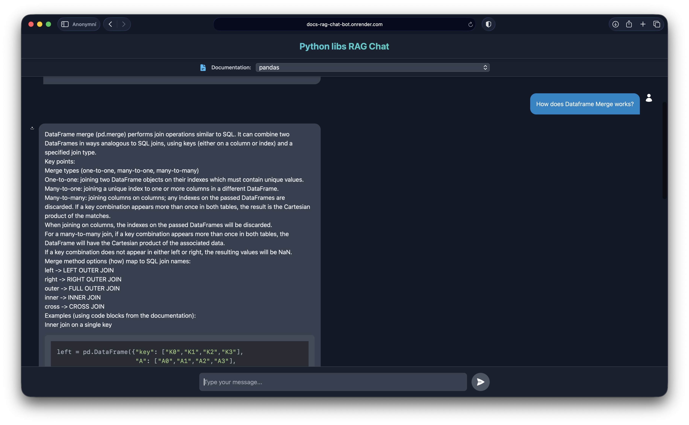
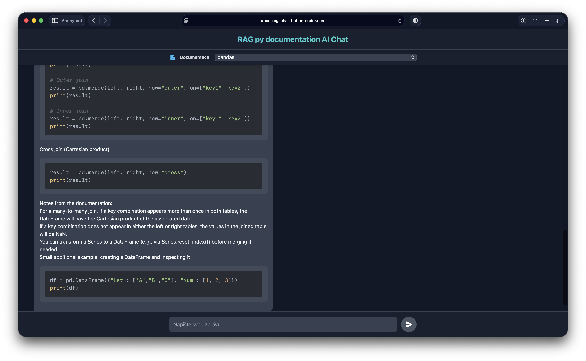
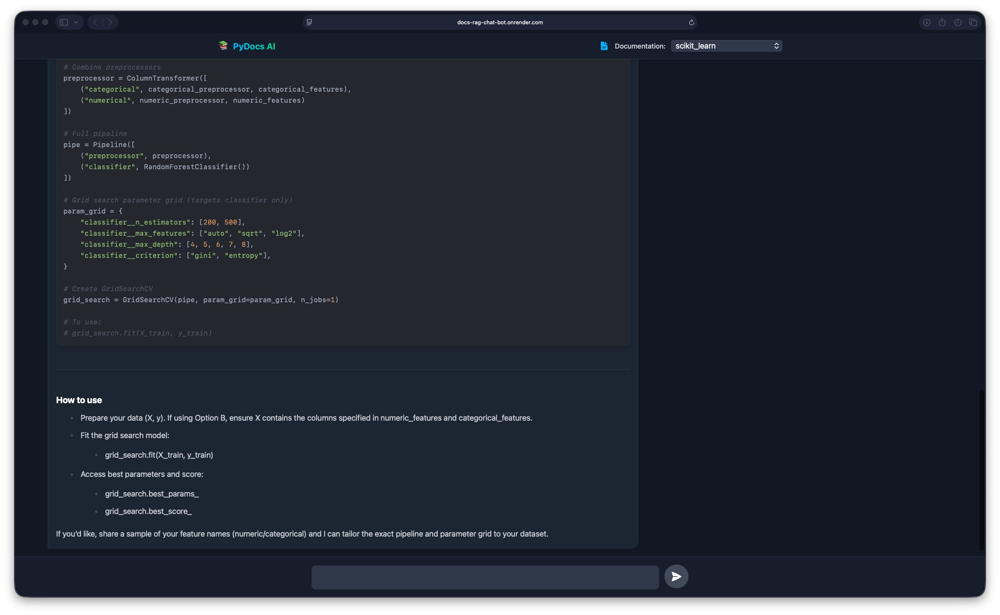

# RAG Documentation Chatbot: Python libraries expert
App is **live** on Render at https://docs-rag-chat-bot.onrender.com
- server has a cold-start (15-40 sec) because of Render free tier policy. Therefore UI will show loading for this period of time, until backend server API's are up and running.

> **Quick Summary:** A full-stack Retrieval-Augmented Generation (RAG) system designed to solve the "hallucination" problem in LLM's repsonses, written from scratch in Python. It ingests raw HTML documentation, creates semantic embeddings, and grounds LLM responses in factual data from libraries like Pandas, NumPy, and Scikit-learn. This allows LLM to have the right context when asked a question about python libraries.

---

## 📊 Project Scope: Accuracy through Context

This project contrasts standard LLM usage with a grounded **RAG (Retrieval-Augmented Generation)** pipeline. By retrieving exact documentation snippets before answering, the system minimizes errors and provides reliable code examples. User gets relevant information from documentation with LLM own output and will get more reliable information than with plain LLM usage. 

## 🏆 Key Capabilities

| Component | Feature | Technology |
| :--- | :--- | :--- |
| **Smart Ingestion** | Context-aware HTML parsing & semantic chunking. | `BeautifulSoup4` |
| **Vector Search** | High-dimensional similarity search (3072 dim). | `pgvector` (Neon.tech) |
| **Inference** | Grounded answers using retrieved context. | `GPT-5-nano` |
| **Frontend** | Responsive, modern chat interface. | `React` + `Tailwind` |

### Currently Supported Docs
*   **Data Science:** Pandas, NumPy, Scikit-Learn
*   **Visualization:** Matplotlib, Seaborn
*   **Database:** SQLAlchemy

---

## 🛠️ Engineering Highlights

### 1. Custom Ingestion Pipeline (`embedd_docs.py`)
Standard text splitters often break code blocks or separate headers from their content. This project implements a **semantic ingestion engine**:
*   **Context Preservation:** Splits HTML pages based on logical sections (Headings `<h1>`-`<h6>`) rather than arbitrary character counts.
*   **Resiliency:** Implements a checkpoint system (`checkpoints.json`) to handle large datasets and resume interrupted jobs seamlessly.
*   **Batch Processing:** Optimizes OpenAI API usage with batched embedding requests. Also save data in batches to DB to optimize DB queries.

### 2. High-Fidelity Embeddings (OpenAI)
The system utilizes OpenAI's **text-embedding-3-large** model for superior semantic understanding.
*   **Why?** The 3072-dimensional vectors provide significantly better nuance for technical terminology compared to smaller models.
*   **Efficiency:** Batched conversion and bulk upserts to PostgreSQL ensure high performance during documentation ingestion.

### 3. RAG Architecture
Instead of relying on a "Black Box" LLM, the system uses a "Glass Box" retrieval method:
1.  **Vectorization:** User queries are converted to embeddings in real-time.
2.  **Similarity Search:** `pgvector` retrieves chunks using Euclidean distance.
3.  **Prompt Injection:** The LLM is forced to use *only* the provided context, ensuring factual accuracy.

### 4. REST API & Cloud Deployment (FastAPI + Docker)
Exposed the core RAG logic via a robust FastAPI backend, ensuring high-performance asynchronous handling of concurrent user requests.
*   **API Design:** Implemented asynchronous endpoints for query processing and documentation management
*   **Containerization:** The application is **Dockerized**, encapsulating the Python environment and dependencies to ensure "it works on my machine" consistency in the cloud.
*   **Live Deployment:** Configured for automated deployment on **Render**, creating a publicly accessible endpoint where the React frontend and Python backend communicate seamlessly in a production environment.

---

## 🔍 Visual Demonstration

### Interface & Performance
The frontend provides a seamless experience for selecting documentation sources and receiving grounded answers.

  
  
  

---

## 💻 Tech Stack
*   **Backend:** Python 3.12, FastAPI, SQLAlchemy, BeautifulSoup4
*   **Infrastructure:** PostgreSQL (Neon.tech - pgvector), Docker, Render
*   **AI/ML:** OpenAI API (Embeddings & Chat)
*   **Frontend:** React (Vite)

---
*Created in collaboration with [SwytDrymz](https://github.com/SwytDrymz)*
